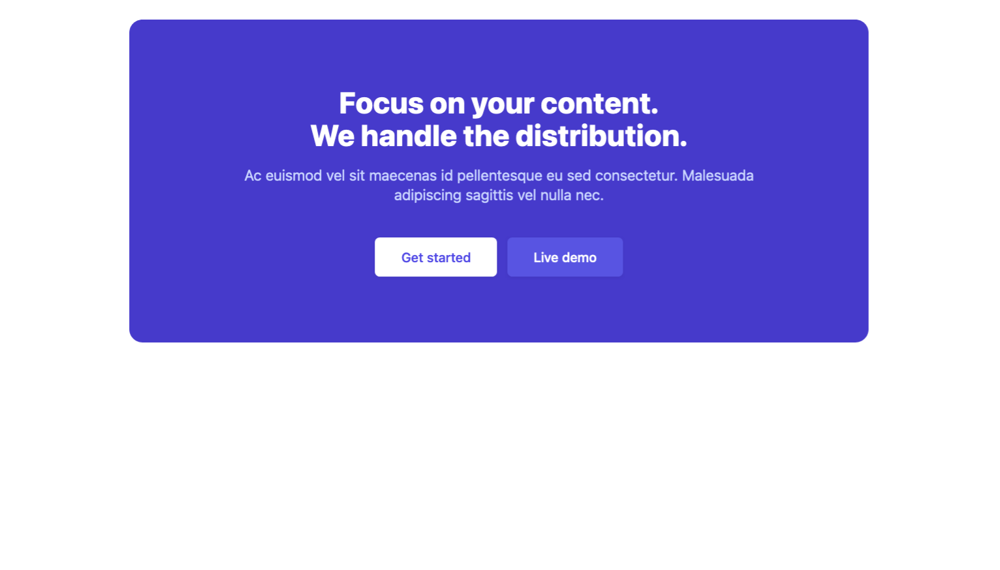

# R3.12 TD2 2026/2027

## Installation deTailwind CSS 4

[installation](https://tailwindcss.com/docs/installation/using-vite)

- Créer un dossier `TD2-TailwindCSS` sur le bureau et l'ouvrir dans VSCode

- Initialiser un projet Vite avec React JS et installer TailwindCSS

> ```shell
> # Installation du projet Vite dans le dossier courant - choisir React JS
> npm create vite@latest . -- --template vanilla
>
> # Installation de TailwindCSS
> npm install tailwindcss @tailwindcss/vite
> ```

- Modifier votre structure de projet

```Plaintext
TD2-TailwindCSS/
  L public/
    - vite.svg ❌
  L src/
    L asssets/
      - hero.png ❌
      - javascript.svg ❌
      - vite.svg ❌
    - counter.js ❌
    - main.js ❌
    - style.css
  index.html
  package.json
```

- Configure the Vite plugin en créant un fichier `vite.config.js` :

> ```js
> // vite.config.js
> import { defineConfig } from "vite";
> import tailwindcss from "@tailwindcss/vite";
> export default defineConfig({
>   plugins: [tailwindcss()],
> });
> ```

- Ajouter Prettier :
  [doc](https://tailwindcss.com/docs/editor-setup#class-sorting-with-prettier)

> ```shell
> npm install -D prettier prettier-plugin-tailwindcss
> ```

- Ajouter la configuration Prettier :

> ```js
> // .prettierrc
> {
>   "plugins": ["prettier-plugin-tailwindcss"]
> }
> ```

- Installation de l'extension Tailwind CSS IntelliSense dans VSCode

- Modifier le fichier `index.html` :

```html
<!DOCTYPE html>
<html>
  <head>
    <meta charset="UTF-8" />
    <meta name="viewport" content="width=device-width, initial-scale=1.0" />
    <link href="/src/style.css" rel="stylesheet" />
  </head>
  <body>
    <h1 class="text-3xl font-bold underline">Hello world!</h1>
  </body>
</html>
```

- Modifier le fichier `style.css` :

```css
@import "tailwindcss";
```

---

## Exercices :

### Exercice 1 : Créer une carte Call to Action avec TailwindCSS

- 1 Créer une carte Call to Action avec TailwindCSS en utilisant les classes de base ([couleur indigo](https://tailwindcss.com/docs/customizing-colors#default-color-palette)).




```html
<!-- Card Component -->
<article class="">
  <h2 class="">
    Focus on your content.
    <br />
    We handle the distribution.
  </h2>
  <p class="">
    Ac euismod vel sit maecenas id pellentesque eu sed consectetur. Malesuada
    adipiscing sagittis vel nulla nec.
  </p>
  <div class="">
    <a href="#" class=""> Get started </a>
    <a href="#" class=""> Live demo </a>
  </div>
</article>
```

### Exercice 2 : Créer un thème clair et un thème sombre avec TailwindCSS

- 2 Configuration des Variables CSS dans le fichier `style.css`

```css
@import "tailwindcss";

@theme inline {
  /* Déclaration de variables CSS dans le thème permet de générer également les classes utilitaires : bg-background, text-background... */
  --color-background: var(--background);
  --color-foreground: var(--foreground);
}

@layer base {
  :root {
    /* Tokens Primitives */

    /* Format OKLCH: Lightness Chroma Hue */
    /* L: 0-1 (0=noir, 1=blanc) */
    /* C: 0-0.4 (0=gris, plus élevé=plus saturé) */
    /* H: 0-360 (teinte en degrés) */

    --clr-light: oklch(1 0 0);
    --clr-dark: oklch(0 0 0);

    /* Tokens Sémantiques */
    --background: var(--clr-light);
    --foreground: var(--clr-dark);
  }

  .dark {
    --background: var(--clr-dark);
    --foreground: var(--clr-light);
  }
}
```

- Créer des thèmes Red, Neon ...


## Remarques : Tokens CSS : primitif vs sémantique

En CSS, les variables peuvent être organisées selon deux niveaux de sens :

- Les **tokens primitifs** représentent des valeurs de base, sans contexte métier. Ce sont des couleurs, des tailles, des espaces ou des valeurs techniques de référence.
- Les **tokens sémantiques** représentent des rôles fonctionnels. Ils utilisent les valeurs primitives pour exprimer une intention visuelle : fond, texte, bordure, accent, etc.

Exemple simple :

```css
:root {
  /* Tokens primitifs */
  --clr-white: oklch(1 0 0);
  --clr-black: oklch(0 0 0);
  --space-sm: 8px;
  --space-md: 16px;

  /* Tokens sémantiques */
  --background: var(--clr-white);
  --foreground: var(--clr-black);
  --surface-padding: var(--space-md);
}
```

On distingue donc :

- `--clr-white` : valeur primitive, c’est une couleur de base
- `--background` : valeur sémantique, c’est le fond de l’interface
- `--surface-padding` : valeur sémantique, c’est l’espace appliqué à un bloc UI

Cette logique permet d’évoluer facilement le design : on peut modifier la couleur primitive sans changer tout le système, ou changer la signification d’un thème sans casser l’ensemble des composants.

Par exemple, dans un thème sombre :

```css
.dark {
  --background: var(--clr-black);
  --foreground: var(--clr-white);
}
```

La structure reste cohérente, mais le rendu visuel change selon le contexte.
